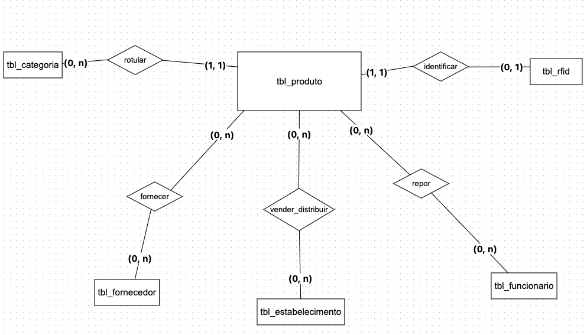
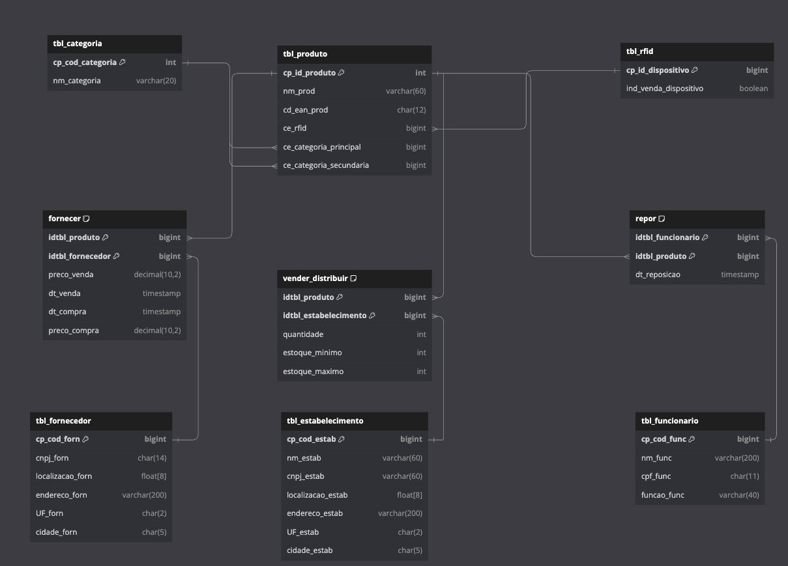

# TRILHA PRÁTICA I

## Discentes: Norma Oliveira do Espírito Santo e Ian Felix Santos de Jesus

### Novas Informações

Com o objetivo de ampliar a funcionalidade do banco de dados, incrementamos novas entidades e atributos que tornam as operações mais ágeis e garantem um maior nível de controle e organização sobre os dados armazenados.

---

## Novos Atributos

### Adição da coluna `dt_inclusao` na tabela `tbl_produto`:

- **Tipo**: `TIMESTAMP`
- **Descrição**: Data de inclusão ou última atualização do produto.
- **Objetivo**: Rastrear quando o produto foi incluído no sistema ou atualizado pela última vez.
- **Benefício**: Proporciona maior controle e rastreabilidade das informações sobre os produtos, sendo útil para auditorias e análise histórica.

### Adição da coluna `telefone_estab` na tabela `tbl_estabelecimento`:

- **Tipo**: `VARCHAR(15)`
- **Descrição**: Telefone de contato do estabelecimento.
- **Objetivo**: Armazenar o contato telefônico do estabelecimento.
- **Benefício**: Facilita a comunicação com os estabelecimentos para operações, como coordenação de estoques e suporte.

### Adição das colunas `dt_contratacao` e `email_func` na tabela `tbl_funcionario`:

- **`dt_contratacao`**:
  - **Tipo**: `DATE`
  - **Descrição**: Data de contratação do funcionário.
- **`email_func`**:
  - **Tipo**: `VARCHAR(100)`
  - **Descrição**: Endereço de e-mail do funcionário.
- **Objetivo**: Monitorar o tempo de serviço dos funcionários e melhorar a comunicação com eles.
- **Benefício**: Ajuda na gestão de pessoal e comunicação interna.

### Adição das colunas `telefone_forn` e `email_forn` na tabela `tbl_fornecedor`:

- **`telefone_forn`**:
  - **Tipo**: `VARCHAR(15)`
  - **Descrição**: Telefone de contato do fornecedor.
- **`email_forn`**:
  - **Tipo**: `VARCHAR(100)`
  - **Descrição**: Endereço de e-mail do fornecedor.
- **Objetivo**: Armazenar informações de contato dos fornecedores.
- **Benefício**: Facilita negociações, solicitações e resoluções rápidas de problemas com fornecedores.

---

## Novas Entidades

### Tabela `tbl_estoque`

- **Objetivo**: Atender aos requisitos RF1 e RF6, permitindo o controle do estoque por localização (lojas ou depósitos), com quantidades mínimas e máximas definidas para cada item.

### Tabela `tbl_vendas`

- **Objetivo**: Atender aos requisitos RF3 e RF5, fornecendo relatórios sobre vendas e vazão de produtos.

### Tabela `tbl_ordens_compra`

- **Objetivo**: Automatizar o controle de reabastecimento e ordens de compra para fornecedores (RF4 e RF6).

---

## Relacionamentos Adicionais

- **Entre `tbl_estoque` e `tbl_vendas`**: O estoque é reduzido automaticamente após uma venda ser registrada.
- **Entre `tbl_ordens_compra` e `tbl_fornecedor`**: Ligação direta para rastrear fornecedores de produtos específicos.

---

## Modelos Conceitual e Lógico





---

## DDL do Banco de Dados

```sql
-- Tabelas principais
CREATE TABLE tbl_produto (
    cp_id_produto INT AUTO_INCREMENT PRIMARY KEY,
    nm_prod VARCHAR(60) NOT NULL,
    cd_ean_prod CHAR(12) NOT NULL,
    ce_rfid BIGINT NOT NULL,
    ce_categoria_principal BIGINT NOT NULL,
    ce_categoria_secundaria BIGINT,
    FOREIGN KEY (ce_rfid) REFERENCES tbl_rfid(cp_id_dispositivo),
    FOREIGN KEY (ce_categoria_principal) REFERENCES tbl_categoria(cp_cod_categoria),
    FOREIGN KEY (ce_categoria_secundaria) REFERENCES tbl_categoria(cp_cod_categoria)
);

CREATE TABLE tbl_categoria (
    cp_cod_categoria INT PRIMARY KEY,
    nm_categoria VARCHAR(20) NOT NULL
);

CREATE TABLE tbl_rfid (
    cp_id_dispositivo BIGINT PRIMARY KEY,
    ind_venda_dispositivo BOOLEAN NOT NULL
);

CREATE TABLE tbl_estabelecimento (
    cp_cod_estab BIGINT PRIMARY KEY,
    nm_estab VARCHAR(60) NOT NULL,
    cnpj_estab VARCHAR(60) NOT NULL,
    localizacao_estab FLOAT[8] NOT NULL,
    endereco_estab VARCHAR(200) NOT NULL,
    UF_estab CHAR(2) NOT NULL,
    cidade_estab CHAR(5) NOT NULL
);

CREATE TABLE tbl_funcionario (
    cp_cod_func BIGINT PRIMARY KEY,
    nm_func VARCHAR(200) NOT NULL,
    cpf_func CHAR(11) NOT NULL,
    funcao_func VARCHAR(40) NOT NULL
);

CREATE TABLE tbl_fornecedor (
    cp_cod_forn BIGINT PRIMARY KEY,
    cnpj_forn CHAR(14) NOT NULL,
    localizacao_forn FLOAT[8] NOT NULL,
    endereco_forn VARCHAR(200) NOT NULL,
    UF_forn CHAR(2) NOT NULL,
    cidade_forn CHAR(5) NOT NULL
);

-- Tabelas de relacionamento
CREATE TABLE fornecer (
    idtbl_produto BIGINT,
    idtbl_fornecedor BIGINT,
    preco_venda DECIMAL(10,2),
    dt_venda TIMESTAMP,
    dt_compra TIMESTAMP,
    preco_compra DECIMAL(10,2),
    PRIMARY KEY (idtbl_produto, idtbl_fornecedor),
    FOREIGN KEY (idtbl_produto) REFERENCES tbl_produto(cp_id_produto),
    FOREIGN KEY (idtbl_fornecedor) REFERENCES tbl_fornecedor(cp_cod_forn)
);

CREATE TABLE vender_distribuir (
    idtbl_produto BIGINT,
    idtbl_estabelecimento BIGINT,
    quantidade INT NOT NULL,
    estoque_minimo INT NOT NULL,
    estoque_maximo INT NOT NULL,
    PRIMARY KEY (idtbl_produto, idtbl_estabelecimento),
    FOREIGN KEY (idtbl_produto) REFERENCES tbl_produto(cp_id_produto),
    FOREIGN KEY (idtbl_estabelecimento) REFERENCES tbl_estabelecimento(cp_cod_estab)
);

CREATE TABLE repor (
    idtbl_funcionario BIGINT,
    idtbl_produto BIGINT,
    dt_reposicao TIMESTAMP DEFAULT CURRENT_TIMESTAMP,
    PRIMARY KEY (idtbl_funcionario, idtbl_produto),
    FOREIGN KEY (idtbl_funcionario) REFERENCES tbl_funcionario(cp_cod_func),
    FOREIGN KEY (idtbl_produto) REFERENCES tbl_produto(cp_id_produto)
);
```

---

## População do Banco de Dados

Para atender ao requisito de população com pelo menos 200 registros, foi criado um script que gera dados aleatórios mantendo a integridade referencial entre as tabelas:

```sql
-- Função auxiliar para gerar CNPJ aleatório
CREATE OR REPLACE FUNCTION random_cnpj() RETURNS char(14) AS $$
BEGIN
    RETURN LPAD(FLOOR(RANDOM() * 99999999999999)::TEXT, 14, '0');
END;
$$ LANGUAGE plpgsql;

-- Função para gerar CPF aleatório
CREATE OR REPLACE FUNCTION random_cpf() RETURNS char(11) AS $$
BEGIN
    RETURN LPAD(FLOOR(RANDOM() * 99999999999)::TEXT, 11, '0');
END;
$$ LANGUAGE plpgsql;

-- Função para gerar EAN aleatório
CREATE OR REPLACE FUNCTION random_ean() RETURNS char(12) AS $$
BEGIN
    RETURN LPAD(FLOOR(RANDOM() * 999999999999)::TEXT, 12, '0');
END;
$$ LANGUAGE plpgsql;

-- Popular categorias (200 categorias)
INSERT INTO tbl_categoria (cp_cod_categoria, nm_categoria)
SELECT
    generate_series(1, 200),
    CASE
        WHEN generate_series <= 50 THEN 'Bebidas ' || generate_series
        WHEN generate_series <= 100 THEN 'Congelados ' || generate_series
        WHEN generate_series <= 150 THEN 'Mercearia ' || generate_series
        ELSE 'Utilidades ' || generate_series
    END;

-- Popular RFIDs (200 RFIDs)
INSERT INTO tbl_rfid (cp_id_dispositivo, ind_venda_dispositivo)
SELECT
    generate_series(1, 200) as cp_id_dispositivo,
    (random() > 0.5) as ind_venda_dispositivo;

-- Popular estabelecimentos (200 estabelecimentos)
INSERT INTO tbl_estabelecimento (cp_cod_estab, nm_estab, cnpj_estab, localizacao_estab, endereco_estab, UF_estab, cidade_estab)
SELECT
    generate_series(1, 200),
    CASE
        WHEN generate_series <= 150 THEN 'Loja ' || generate_series
        ELSE 'Depósito ' || (generate_series - 150)
    END,
    random_cnpj(),
    ARRAY[random(), random(), random(), random(), random(), random(), random(), random()],
    'Rua ' || chr(floor(65 + random() * 26)::int) || ', ' || floor(random() * 1000)::int,
    (ARRAY['SP','RJ','MG','BA','RS','SC','PR','PE','CE','AM'])[floor(random() * 10 + 1)],
    LPAD(floor(random() * 99999)::TEXT, 5, '0');

-- Popular funcionários (200 funcionários)
INSERT INTO tbl_funcionario (cp_cod_func, nm_func, cpf_func, funcao_func)
SELECT
    generate_series(1, 200),
    'Funcionário ' || generate_series,
    random_cpf(),
    (ARRAY['Repositor','Supervisor','Gerente','Auxiliar','Coordenador','Analista','Operador'])[floor(random() * 7 + 1)];

-- Popular fornecedores (200 fornecedores)
INSERT INTO tbl_fornecedor (cp_cod_forn, cnpj_forn, localizacao_forn, endereco_forn, UF_forn, cidade_forn)
SELECT
    generate_series(1, 200),
    random_cnpj(),
    ARRAY[random(), random(), random(), random(), random(), random(), random(), random()],
    'Rua ' || chr(floor(65 + random() * 26)::int) || ', ' || floor(random() * 1000)::int,
    (ARRAY['SP','RJ','MG','BA','RS','SC','PR','PE','CE','AM'])[floor(random() * 10 + 1)],
    LPAD(floor(random() * 99999)::TEXT, 5, '0');

-- Popular produtos (200 produtos)
INSERT INTO tbl_produto (cp_id_produto, nm_prod, cd_ean_prod, ce_rfid, ce_categoria_principal, ce_categoria_secundaria)
SELECT
    generate_series(1, 200),
    'Produto ' || generate_series,
    random_ean(),
    generate_series,
    floor(random() * 200 + 1),
    CASE WHEN random() > 0.5 THEN floor(random() * 200 + 1) ELSE NULL END;

-- Popular fornecer (200 registros)
INSERT INTO fornecer (idtbl_produto, idtbl_fornecedor, preco_venda, dt_venda, dt_compra, preco_compra)
SELECT
    floor(random() * 200 + 1),
    floor(random() * 200 + 1),
    (random() * 1000)::numeric(10,2),
    NOW() - (random() * 365 || ' days')::interval,
    NOW() - (random() * 365 || ' days')::interval,
    (random() * 800)::numeric(10,2)
FROM generate_series(1, 200);

-- Popular vender_distribuir (200 registros)
INSERT INTO vender_distribuir (idtbl_produto, idtbl_estabelecimento, quantidade, estoque_minimo, estoque_maximo)
SELECT
    floor(random() * 200 + 1),
    floor(random() * 200 + 1),
    floor(random() * 1000 + 1),
    floor(random() * 50 + 10),
    floor(random() * 1000 + 100)
FROM generate_series(1, 200);

-- Popular repor (200 registros)
INSERT INTO repor (idtbl_funcionario, idtbl_produto, dt_reposicao)
SELECT
    floor(random() * 200 + 1),
    floor(random() * 200 + 1),
    NOW() - (random() * 30 || ' days')::interval
FROM generate_series(1, 200);

-- Remover funções auxiliares
DROP FUNCTION IF EXISTS random_cnpj();
DROP FUNCTION IF EXISTS random_cpf();
DROP FUNCTION IF EXISTS random_ean();
```

Este script gera dados aleatórios para todas as tabelas, mantendo a integridade referencial e as regras de negócio definidas. Cada tabela recebe pelo menos 200 registros, atendendo ao requisito mínimo de população do banco de dados.
